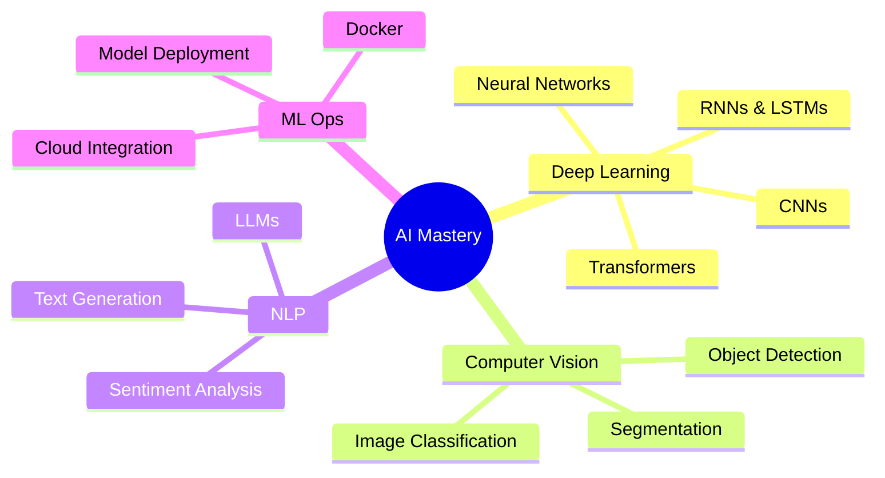

# 🤖 Adil Chagri | AI Engineer & Creative Developer

<div align="center">
  
```ascii
     ___    ____     ____       __          ______   __  __    ___     ______   ____    ____  
    /   |  / __ \   /  _/      / /         / ____/  / / / /   /   |   / ____/  / __ \  /  _/  
   / /| | / / / /   / /       / /         / /      / /_/ /   / /| |  / / __   / /_/ /  / /    
  / ___ |/ /_/ /  _/ /       / /___      / /___   / __  /   / ___ | / /_/ /  / _, _/ _/ /     
 /_/  |_/_____/  /___/      /_____/      \____/  /_/ /_/   /_/  |_| \____/  /_/ |_| /___/     
```

### 🎓 Master's in Artificial Intelligence | 💻 Multimedia & Web Specialist | 🧠 Deep Learning Enthusiast

[](https://git.io/typing-svg)

</div>

---

## 🎯 About Me

```python
class AIEngineer:
    def __init__(self):
        self.name = "Adil Chagri"
        self.role = "AI Student & Developer"
        self.location = "Morocco 🇲🇦"
        self.education = {
            "current": "Master in Artificial Intelligence",
            "bachelor": "License in Artificial Intelligence",
            "technical": "BTS Multimedia & Web Design"
        }
        self.interests = ["Deep Learning", "Computer Vision", "NLP", "Web AI Integration"]
    
    def say_hi(self):
        print("Thanks for dropping by! Let's build intelligent systems together 🚀")

me = AIEngineer()
me.say_hi()
```

🔭 Currently working on: **Advanced AI projects integrating ML models with web applications**  
🌱 Learning: **Transformers, GANs, and Reinforcement Learning**  
💡 Passionate about: **Making AI accessible and practical**  
🎨 Creative side: **Multimedia design meets intelligent systems**

---

## 🛠️ Tech Stack

<div align="center">

### 🧠 AI & Machine Learning


### 💻 Web Development


### 🗄️ Database & Tools


### 🎨 Design & Multimedia


</div>

---

## 📊 GitHub Analytics

<div align="center">
  
  
</div>

<div align="center">
  
</div>

<div align="center">
  
</div>

---

## 🏆 Achievements & Highlights

<div align="center">


</div>

---

## 🚀 Featured Projects

<div align="center">

| 🤖 AI/ML Projects | 🌐 Web Projects |
|-------------------|-----------------|
| [](https://github.com/Adilchagri) | [](https://github.com/Adilchagri) |

</div>

---

## 💡 Current Focus



---

## 📫 Let's Connect

<div align="center">

[](https://linkedin.com/in/adilchagri)
[](https://twitter.com/adilchagri)
[](https://adilchagri.dev)
[](mailto:adil@example.com)
[](https://discord.com)

</div>

---

<div align="center">

### 💭 Random Dev Quote


### 🎵 Coding Vibes

[](https://spotify.com)

---


**⚡ "Building intelligent systems, one commit at a time" ⚡**

</div>

---

<div align="center">
  
</div>
